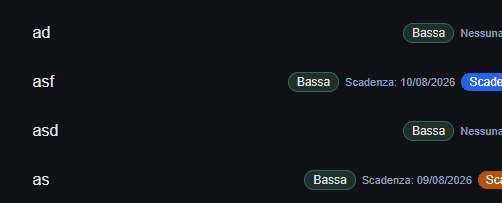

# Task Manager

Task Manager è una mini app React per organizzare attività personali con priorità, scadenze e filtri intelligenti.

## 🚀 Demo live
https://task-manager-beta-teal.vercel.app

## 📸 Screenshot


## 🎬 Demo GIF
### Drag & Drop task


### Filtri scadenze


## ✨ Funzionalità
- Aggiunta di task con titolo e data di scadenza
- Modifica e eliminazione delle task
- Toggle tra completata e da fare
- Gestione della priorità (bassa, media, alta)
- Filtri: Tutte, In scadenza, Scadute
- Evidenziazione visiva per task in ritardo
- Salvataggio persistente in localStorage
- Ordinamento intelligente: task scadute prima, poi quelle in scadenza, poi senza data

## 🛠️ Stack tecnico
- React
- Vite
- JavaScript
- CSS

## 📦 Avvio in locale
```bash
npm install
npm run dev
```

## 🧠 Cosa ho imparato
- gestione dello stato con React
- persistenza dati nel browser con localStorage
- organizzazione dei componenti e logica di UI
- miglioramento dell’esperienza utente con filtri e notifiche visive

## 📁 Struttura principale
- src/components/TaskForm.jsx
- src/components/TaskList.jsx
- src/components/TaskItem.jsx
- src/components/TaskFilters.jsx

## 👤 Autore
Progetto realizzato da iqtron.